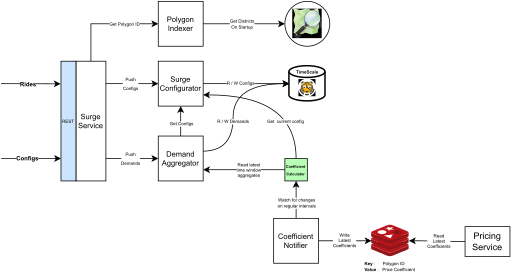
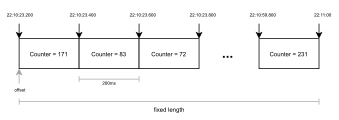
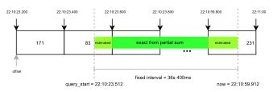

# Snapp Surge

---

## Requirements

 

**A quick recap of what this system is actually dealing with :**
- The most amount of completed rides in a day was last reported by snapp in year 2021 featuring [3 million rides in a single day](https://snapp.ir/blog/snapp-record/) (wow!).
- A simple 80/20 rule would tell us that 80% of the rides are stretched across 20% of the daytime,
- Let's assume that each ride needs at least 2 requests (in an awful day the first attempt fails and the second one is successful) in the peak time.
- Taking in the 80/20 rule, we will experience a good _( 0.8 x 2 x 3M ) / ( 0.2 x 24 x 3600s ) = 278_ ride requests per second in Iran.
  Tehran will be a fraction of this amount. Because it includes around 25% of internet traffic in iran, let's just say we're expecting 70 requests per second for the beta version.

 

### Functional Requirements :
 - We should be able to aggregate the total demand for rides in a sliding time window.
 - Aggregation results must be continuously communicated with pricing service.
 - The surge configurations can be edited at anytime.

 

### Nonfunctional Requirements :
- this system would ideally handle about 100 requests per second without even blushing
- the communication with pricing service must be near realtime cuz it's about money!
- we absolutely need some sort of consistency with the configurations cuz again, it's about money!
- if the pricing service goes down there must be no side effects on surge service whatsoever.
- if the surge service goes down:
  - our pricing service must still be able to provide prices.
  - the surge service must recover its data before declaring readiness again.

 

### Assumptions

1. Each polygon (district) has an ID and this ID is globally known across all services. 
   So much that say when the pricing service has the polygon ID, **it can indirectly know the coordinates of its vertices**.
   This access to a polygons vertices can be provided through a microservice, but it really is not the concern of this surge service anyway
   This assumption is only for the sake of simplicity.
   If there somehow is a limitation on this assumption just replace the polygon ID phrase with the [polyline encoding](https://developers.google.com/maps/documentation/utilities/polylinealgorithm) of the polygon's vertices.
   This way when a client unwraps the polygon ID, it is instantly aware of its vertices.
2. "_Near real time_" means sub second latency for each request to take effect.
3. The pricing service does not necessarily need the changelog of coefficients.
   It only needs to be aware of the latest coefficients at any point of time.
4. The PoC of this service will only serve in Tehran, but our design must not rigidly limit our scale up. And yet it must be simple.

 

So to meet the above requirements, I have prepared a solution that I'll briefly explain in the next sections.

---

## Overview

**a brief explanation of what our service does :**

### Components

The entire service includes 6 components :

1. _Polygon Indexer_ : gets a latitude, longitude pair and returns a global polygon id that is known across the system.
2. _Surge Configurator_ : handles the CRUD operations on surge config and will make sure of the consistency.
3. _Demand Aggregator_ : can both observe new requests and aggregate them in the latest sliding time window whenever called.
4. _Coefficient Calculator_ : puts together the surge config and aggregated demands to calculate the latest coefficients.
5. _Coefficient Notifier_ : establishes a continuous way of notifying the pricing service.
6. _Surge Service_ : wraps all the above components into one interface, which accepts configuration updates and new ride requests.

The dependency diagram of these components can be seen below:

 

### Quick Note 
- The diagram pointers are directed in the way that two components depend on each other.
- There is a text on each pointer briefly explaining how the dependant uses the depended.
- All the above components are loosely coupled therefore they can be a microservice of their own. But it really seems like a bit of over engineering to me personally :D
- You can find a high resolution version of the diagram above [here](https://app.diagrams.net/#G1qGCHi4XYcPNzc3vsVU4nvbfhKfFR-JOs).

 

### How It Works

- **When a ride request is sent to the server :**
  1. first, the latitude and longitude pair will be converted into their corresponding polygon ID through the _Polygon Indexer_.
  2. then the _Demand Aggregator_ will observe this ride request ( polygon_id, time_stamp ).
  3. after that, on fixed intervals (which could also be configured by admins) the _Coefficient Notifier_ will:
     1. get the latest coefficients from _Coefficient Calculator_.
     2. if the coefficient has changed, it pushes the latest coefficients somewhere accessible for the pricing service.

- **When a configuration update is sent to the server :**
  1. the _Surge Configurator_ acquires a lock on its datasource to prevent race conditions.
  2. modifies the config.
  3. releases the acquired lock.

---
## Polygon Indexer

 

**How does it exactly work?**

Before the service declares readiness, it loads all the polygons from [osm](https://openstreetmap.org). 
When this component is called, it iterates through all polygons one by one and checks if the given point is inside it or not using [ray casting](https://en.wikipedia.org/wiki/Point_in_polygon#Ray_casting_algorithm).  
When it finds a polygon, it returns the ID and when it doesn't it simply returns an error.

 

**What happens if our business needs dynamic polygons?**

This component can update its polygons in regular intervals from a single datasource. 
This way if you update that data source it will take effect after a delay.  
But since these kinds of update hardly ever happen, we can simply restart our service when a polygon update is pushed.  

 

**Scaling Up**

The above algorithm to find the polygon of a point is done with order complexity of _O(N x V)_.  
In which _N_ is the total number of polygons, and _V_ is the average number of vertices in each polygon.  
So when we move on to deploy this surge feature in the whole country we'll have about 100 cities.  
Each city containing on average 10 polygons and each polygon containing on average 35 sides,  
will leave us with a problem space of 35000 records. Let's say on average we will search only 17500 records.  
That would be almost 6 queries per second with a single CPU core.  
So how do we scale it up?
- we can spawn goroutines and give in more resources for more parallel computation.
- we can reorder the polygons in such order that the most popular polygons are seen sooner than the less popular ones.
- we can build an index from all the polygons. how?
  - first use a grid system (e.g. [h3](https://eng.uber.com/h3/)) with a reasonable resolution to partition our coverage area into smaller grid cells.
  - then for each grid cell in our area, we'll store the polygon IDs that cover that cell completely and partially in separate lists.
  - so when a (lat,lng) pair comes up, we'll first find its grid cell id in _O(1)_,
  - then we'll get all the corresponding polygons,
  - we can return the polygons that completely cover the cell instantly.
  - but for the polygons that only cover the cell partially, we'll have to use ray casting again.
  - this index will provide us with _O(1)_ queries in average case.
  - the memory overhead of this method can be managed through configuring the grid resolution.

---

## Surge Configurator

 

**How does it exactly work?**

This one is pretty straight forward. the config must be stored inside an SQL database for consistency.  
Before each update we'll have to acquire a lock to prevent race conditions.  
The lock can be distributed (e.g. in redis or zookeeper) but it is way simpler that we just lock the whole SQL table.

 

**What if we wanted to plan ahead?**

We can have the schema below to plan ahead for the future. 
<table>
    <tr>
        <th>
            column
        </th>
        <th>
            type
        </th>
        <th>
            nullable
        </th>
    </tr>
    <tr>
        <th>
            threshold
        </th>
        <th>
            uint
        </th>
        <th></th>
    </tr>
    <tr>
        <th>
            coefficient
        </th>
        <th>
            double
        </th>
        <th></th>
    </tr>
    <tr>
        <th>
            valid_from
        </th>
        <th>
            datetime
        </th>
        <th>
            x
        </th>
    </tr>
    <tr>
        <th>
            valid_to
        </th>
        <th>
            datetime
        </th>
        <th>
            x
        </th>
    </tr>
</table>
Keeping the consistency of this schema is a little harder, because we will have to make sure that:

- no two configurations are valid in the same time.
- we'll always have some valid config for any given point of time.

Please note that this schema will keep a complete log of our config changes too.

 

**Scaling Up**

Since we only calculate coefficients on regular intervals and only once in every pod,  
there is actually a really low chance that the retrieval of the configs becomes a bottleneck.  
So we'll purposefully ignore it.

---
## Demand Aggregator

 

**How does it exactly work?**

On each ride request it simply inserts the observation into a data source (e.g. PostgreSQL).  
The data scheme would be sth like below:
<table>
    <tr>
        <th>
            column
        </th>
        <th>
            type
        </th>
        <th>
            nullable
        </th>
    </tr>
    <tr>
        <th>
            polygon_id
        </th>
        <th>
            uint
        </th>
        <th></th>
    </tr>
    <tr>
        <th>
            timestamp
        </th>
        <th>
            datetime
        </th>
        <th></th>
    </tr>
</table>
Everytime the .aggregate(interval) method is called it performs an aggregate query on it's datasource and returns the results.

 
 
 

**Scaling Up Write Throughput**

When the single inserts into db do not work, we can simply bulk insert in mini batches.  
These batches must be limited by both time and size. This way our average latency would increase, but we will be able to write more observations per second. 

 

**Achieving Near realtime latency on Reads (Aggregates)**

The aggregation is performed on regular intervals, and it really doesn't seem to become the bottleneck here.
But when we decrease our interval time to sub second values the io cost will become more evident.  
So in order to achieve near real time aggregates we can:
- use an OLAP tuned for time series or a faster db in general
  - e.g. we can use [influxdb](https://www.influxdata.com/) or [MongoDB](https://www.mongodb.com/) instead of SQL.
  - it is way more convenient to just install a [timescale](https://www.timescale.com/) db extension on a regular pgSQL.
  - this method is probably not going to work because our data is small.
  - if our interval is like 200ms we'll have about 40 ride requests at max.
  - taking in the amount of network and overall io cost, it really is improbable that these dbs have that much of a difference in such small counts.
  
 

- perform the aggregations in memory using a data structure
  - we can partition time into buckets that are the size of our smallest required interval. (e.g. 200ms)
  - in order to keep a simple sliding time window for each polygon we can store consecutive buckets in an array in like below:

  - 

  - offset is a pointer that shows the oldest bucket among all.
  - the pre offset element is the youngest bucket.
  - each array element also has a counter value which represents the number of observations occurred in that bucket.
  - so when a new observation is made:
    - if the last bucket of the array's time has not come yet,
      - simply increment the last (youngest) bucket's counter by one
    - if the bucket's time has passed,
      - replace the first bucket (the oldest bucket) with a new bucket that has a counter of 1
      - shift the buckets (simply increment an offset parameter by one)
      - if the offset is out of range, it simply goes back to 0 again.
  - this data structure can keep a sliding window of given size by a rough estimation. but it's really simple.
  - keeping a partial sum on this array's buckets' counters will let us have reads and writes of _O(1)_
  
  - 
  
  - as you can see, when an aggregate query is needed, we have the exact amount for all the buckets in between, but we estimate the front and rear bucket's counts.

 

**Benefits of the above datastructure**

- it has fixed size, which means we're not going to experience memory leak.  
- it can be stored in arrays (instead of linked lists for example) so there'll be no heap pollution as well :).

 

**TradeOffs of having in memory Aggregations**

the data structure above estimates the aggregation and this estimation's accuracy solely depends on bucket size. if you decrease the bucket_size
you'll have some memory overhead. it's simply a tradeoff.  
it is obvious that every ride request of a polygon needs to be observed by a single pod so that it is processed within one instance of our datastructure.  
this means that our service will become stateful.  
managing and deploying stateful services is in itself a challenge but if we have already experienced it, it might be easy for the team.  
We can also keep the whole data structure in a redis instance (with snapshots enabled) to be stateless again and achieve 50~80 ms latencies.  
Plus we need to create the data structure from  our db before declaring readiness.  
The complete sync between an in memory data structure and the db cannot be guaranteed either.  

---

## Coefficient Calculator

 

**How does it exactly work?**

it simply gets the currently valid config from _Surge Configurator_ and the demands in the latest time window from _Demand Aggregator_.  
Then combines these two to calculate the coefficients for each polygon.  
There really isn't anything to worry about because it's fast and decoupled from other components.

---

## Coefficient Notifier

 

**How does it exactly work?**

It is a goroutine in the background continuously watching the output of _Coefficient Calculator_.  
When coefficients change it pushes the latest values to redis for the pricing service.

 

**Why redis?**

So we wanted to handle downtimes of both surge service and pricing service.  
When we put a stable service like redis in between, during the surge downtime, there still are some usable coefficients in redis.  
and when the pricing service comes down, we will ignorantly just continue to work.

 

**Okay... but why not memcached?**

Redis supports [pipelines](https://redis.io/docs/manual/pipelining/).  
We can happily put all the _100 cities x 10 polygons / city = 1000 polygons_ coefficients into redis with a single pipeline.
It can also be configured to have snapshots. 

 

**How about a queue?**

Queues are okay, but when I think about it, I don't think the pricing service wants events or change logs from surge.  
It only needs the latest coefficients.  
So we can provide a simpl solution by only storing the latest coefficients somewhere.  
If we were to push change logs into a queue, the pricing service should've implemented a logic to store the latest coefficients somewhere. 
